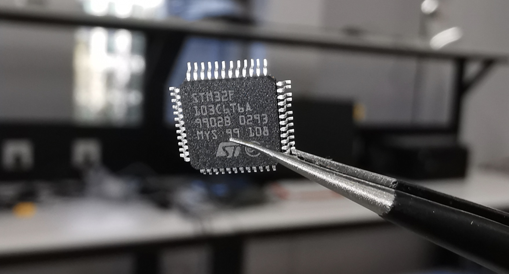

#  STM32 IoT CTF 清华校赛版

> 本题目由【纽创信安】 提供，公司主要方向为【硬件安全】与【密码研究】，欢迎实习（就在FIT楼对面的清华科技园）。

提供的STM32 F103C6T6A芯片中藏有6个FLAG，选手需要想办法和这颗芯片通信，把这6个FLAG读出来。

#  相关物料

附件：https://github.com/xuanxuanblingbling/stm32ctf_thu/tree/master/attachment

| 物料                 | 数量 |
| -------------------- | ---- |
| STM32 F103C6T6A 芯片 | 1    |
| LQFP48转DIP48 转接座 |  1    |
| ST-LINK V2 (SWD 接口) | 1    |
| USB转TTL串口 (UART 接口) |   1    |
| USB转5Pin (USB 接口) | 1    |
| 面包板 |  1   |
| LED灯         |  1    |
| 8M 有源 4Pin 直插 晶振 | 1 |
| 1.5K Ω 直插电阻 | 1 |
| 杜邦线（公-母、公-公、母-母） | 10 |

# 题目说明

- GPIO：摩尔斯电码
- UART：接出串口
- USB_1：模拟键盘
- USB_2：USB上还有1个FLAG你能找到在哪么？
- SWD_1：你会调试STM32么？
- SWD_2：彩蛋！

